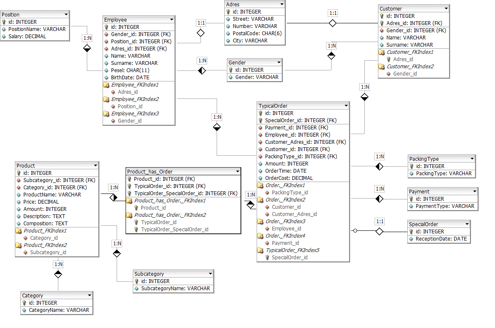

# Bakery
Bakery Management Application. Database stores data about: users, customers, employees, addresses, products, suppliers, and orders. Database structure on diagram below:

## Languages
- Java
- MSSQL

## Project includes
- CRUD
    - Create
    - Read
    - Update
    - Delete
- sorting

## Installation

## Full description