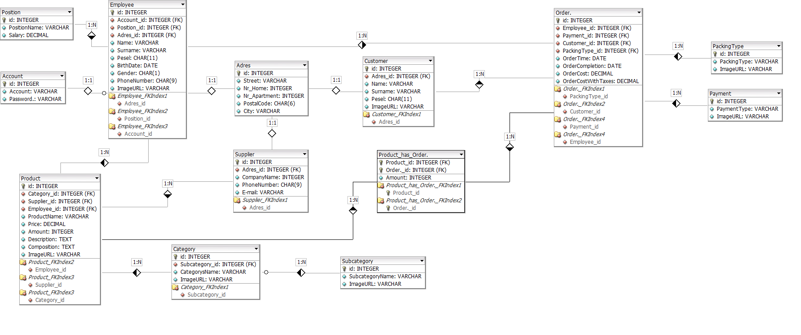
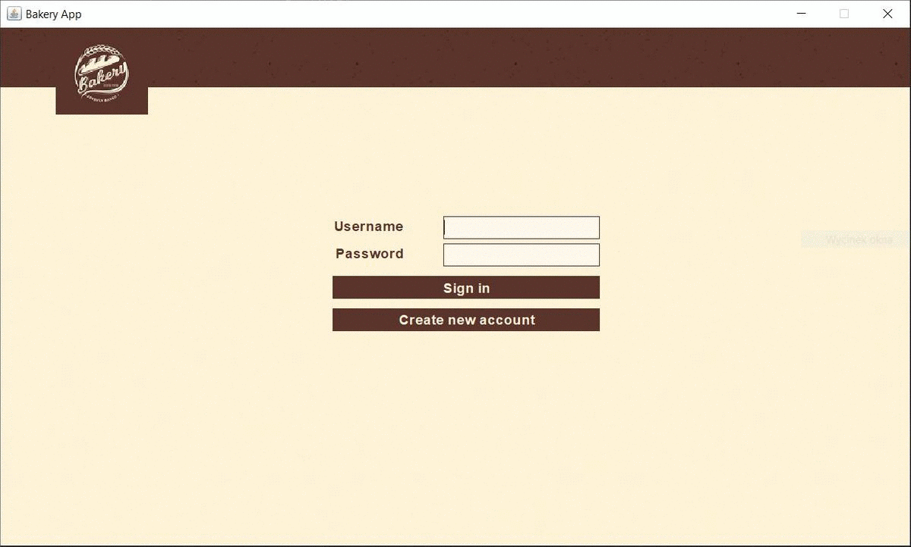

# Bakery
Bakery Management Application. Database stores data about: users, customers, employees, addresses, products, suppliers, and orders. Database structure on diagram below:

## Languages
- Java
- MSSQL

## Project includes
- MSSQL relational normalized database
- CRUDS
    - Create
    - Read
    - Update
    - Delete
    - Search
- User friendly UI and UX
- Data filtering
    - by text
    - by categories
- Sorting data
- Selected statistics
- Security
    - hashing passwords (SHA-256 + salt + pepper)
    - simple regex protection against sql injection and unwanted data
    - PESEL (polish identity number) validator
    - only users with specific ids can acces selected functions

## Installation
- download ZIP or clone the source repository from Github: 
`git clone https://github.com/mateuszniewiadomski/Bakery.git`
- paste it into your Java project
- install jar from `jarFile` folder
- add `logininfo.txt` in first line enter your login to your local databese and in second line password
- if you use IntelliJ, your folder layout should look like this

## Full description
